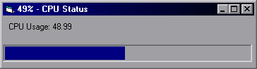



## Get Windows 2000/XP CPU Usage

### Description

Gets the CPU Usage for Windows 2000/XP. This is a sample of using PDH.DLL to sample performance data from Windows 2000. It can be used to monitor any performance data. Should also work in NT 4.0 (Requires VB6 and PDH.DLL - included with Win2k).
 
### More Info
 

             |
---                |---
**Submitted On**   |2000-06-03 17:15:20
**By**             |[pt](https://github.com/Planet-Source-Code/PSCIndex/blob/master/ByAuthor/pt.md)
**Level**          |Intermediate
**User Rating**    |5.0 (40 globes from 8 users)
**Compatibility**  |VB 5\.0, VB 6\.0
**Category**       |[Windows System Services](https://github.com/Planet-Source-Code/PSCIndex/blob/master/ByCategory/windows-system-services__1-35.md)
**World**          |[Visual Basic](https://github.com/Planet-Source-Code/PSCIndex/blob/master/ByWorld/visual-basic.md)
**Archive File**   |[CODE\_UPLOAD6405632000\.zip](https://github.com/Planet-Source-Code/pt-get-windows-2000-xp-cpu-usage__1-8610/archive/master.zip)

